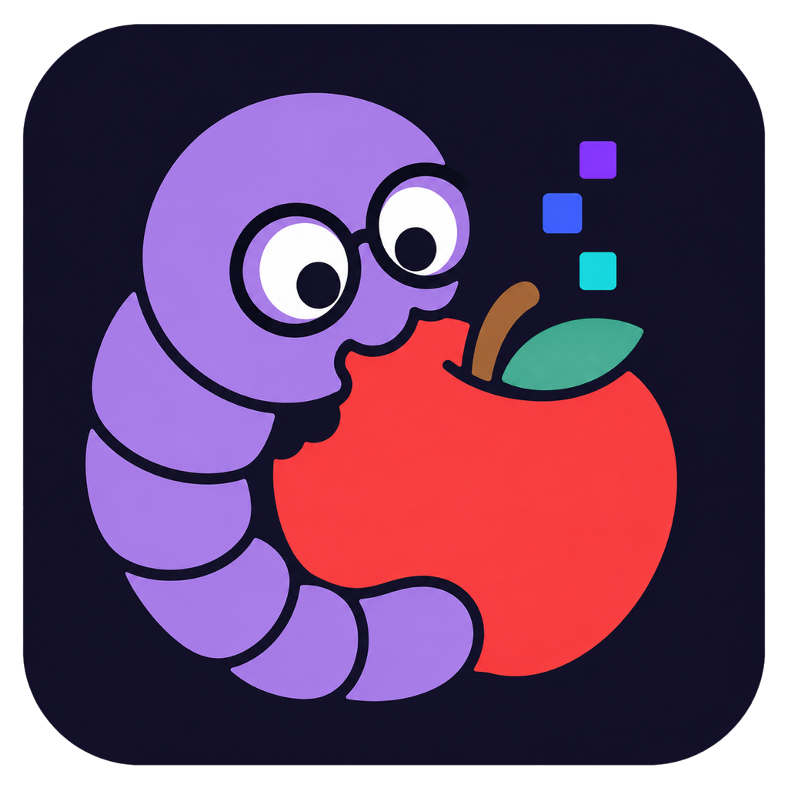

# Wormie IDE



Wormie is an Electron desktop IDE built around one rule: understand first, generate second.

## Built with Codex and GPT-5.6

I treated Codex as an active engineering partner throughout Wormie’s development, not as the source of the product idea or final decision-maker. I set the learning-first product direction, chose what behavior felt right, defined the security and privacy boundaries, and reviewed the resulting experience. Codex helped turn those decisions into working, tested software much faster than I could have built each cross-cutting system alone.

| Area | Decisions I made | How Codex accelerated the work |
| --- | --- | --- |
| Product | Code generation must follow understanding, but routine edits should remain fast. Major-change gates, remediation, challenge mode, and configurable strictness came from that balance. | Codex traced the complete request-to-proposal flow, converted product rules into typed state machines and services, and kept lessons, quizzes, grading, mastery evidence, and proposal review connected. |
| Architecture and security | Wormie is local-first, Electron renderers are untrusted, IPC stays narrow, secrets never enter the renderer, and classroom authority must be verified outside client-provided state. | Codex implemented and reviewed main/preload/renderer boundaries, path validation, secret redaction, secure credential storage, file fingerprints, recovery behavior, Supabase policies, and adversarial tests. |
| Learning system | I chose a persistent knowledge graph, prerequisite detection, spaced review, misconceptions, goals, and evidence-based mastery instead of a generic chatbot memory. | Codex helped model these systems, connect assessment evidence to personalization and review scheduling, and cover migrations and edge cases with tests. |
| UX and design | I chose explicit Sandbox, Classroom, and Assignment modes; a focused IDE layout; review-before-apply controls; restrained motion; and accessibility that never communicates status through color alone. | Codex built and refined the React, Monaco, xterm.js, and Framer Motion interactions, including resizable panels, recovery dialogs, diff review, command navigation, appearance settings, light/dark themes, high contrast, reduced motion, and color-vision-safe palettes. |
| Quality | I made final scope and tradeoff calls and rejected behavior that weakened safety, clarity, or the “understand first” principle. | Codex searched existing flows before editing, made coordinated changes across contracts and process boundaries, diagnosed failing checks, and repeatedly ran Vitest, TypeScript, and production builds until the implementation passed. |

GPT-5.6 was especially useful during the final engineering passes because it could reason across a large TypeScript/Electron codebase while preserving interactions between the renderer, preload bridge, main-process services, local persistence, cloud synchronization, and tests. It accelerated repo-wide refactors and caught failure modes such as stale asynchronous responses, unsafe paths, external file changes, untrusted AI output, missing authorization checks, and accessibility inconsistencies.

Codex also shortened the design loop. I could describe the intended behavior, inspect a concrete implementation, test it in the running product, and give targeted feedback in the same session. GPT-5.6 then revised the smallest relevant surface instead of restarting the feature. That loop let me spend more time on product judgment, teaching quality, and interaction details while still understanding and approving the code being shipped.

All Codex-generated work remained subject to human review and the same verification as handwritten code. The final result reflects my product choices and design taste, with Codex and GPT-5.6 contributing implementation speed, breadth, consistency, and a much tighter test-and-refine cycle.

## Run locally

```powershell
npm install
npm run dev
```

Use `npm run build` for a production build and `npm run dist` to create the desktop installer.

## Product modes

After sign-in, Wormie opens a launcher with two explicit destinations:

- Sandbox IDE is an ordinary coding workspace. It contains the editor, Explorer, search, source control, terminal, Tutor, and IDE settings. Opening a folder here never attaches it to a classroom, even if the folder contains an assignment manifest.
- Classrooms is a full-screen portal for teaching and enrolled classrooms. It contains assignments, people, classroom mastery, and teacher settings without editor or terminal chrome.

Opening a classroom assignment or starting a teacher draft launches Assignment IDE. This mode keeps the coding tools and one focused assignment context. Returning to the classroom uses the existing dirty-file guard before leaving the workspace.

The renderer stores only validated portal selection preferences. It does not restore directly into a classroom or assignment after restart. Editor recovery remains independent and workspace-scoped.

## Assignment workflows

For classroom assignments, a teacher authors a starter workspace from the classroom portal and publishes its integrity-checked package to private Supabase storage. A student opens the assignment from that classroom, and Wormie creates or safely reopens an isolated local workspace. Task progress is stored locally first and synchronized through a bounded, versioned retry queue. Once every task is complete, the student submits directly to the classroom. The teacher can review status, assignment-scoped AI-use summaries, and uploaded submission files from the classroom portal.

Wormie also retains a local package workflow for offline or manually distributed assignments:

1. A teacher exports a `*.wormie-package.json` file from an authored assignment.
2. A student imports the package. Wormie creates an isolated copy and records explicit evidence consent.
3. After completing every task, the student saves a `*.wormie-submission.json` outside the project.
4. The teacher opens that file from the matching teacher assignment workspace.

In both workflows, the Electron main process enforces the assignment AI policy. Learning sessions, quizzes, proposals, and applied changes are recorded only when the student accepted the corresponding evidence collection.

Packages and submissions are integrity checked but are not cryptographically signed. See [docs/ASSIGNMENT_FORMAT.md](docs/ASSIGNMENT_FORMAT.md) for schemas, limits, privacy behavior, and the hosted-service migration boundary.

## Classroom cloud migrations

Supabase migrations are additive and must be applied in filename order. The product-mode work adds:

- `202607190001_classroom_roster_management.sql` for privacy-filtered member reads and teacher-authorized add/remove operations.
- `202607190002_classroom_mastery.sql` for classroom/student mastery snapshots, immutable quiz events, and Row Level Security.
- `202607210001_assignment_progress_submissions.sql` for classroom assignment progress, private submission storage, and teacher review access.
- `202607210002_assignment_progress_hardening.sql` for stricter progress validation, rollback safety, storage authorization, and assignment revision checks.
- `202607210003_assignment_ai_analytics.sql` for privacy-bounded, assignment-scoped AI usage summaries.

The desktop uses only the publishable Supabase key. Roster changes, mastery writes, AI analytics, assignment progress, and submissions go through narrow database functions or private storage policies that re-check the authenticated user, membership, classroom ownership, and assignment relationship. Failed mastery, analytics, and assignment-progress synchronization stays in bounded, versioned local queues and does not erase local history.

The Electron renderer receives only named preload methods. Workspace purpose, classroom IDs, assignment IDs, and request bodies are validated in the main process. Assignment context is derived from Supabase access checks rather than a renderer-provided role. See [the product modes architecture](docs/superpowers/specs/2026-07-19-product-modes-classroom-portal-design.md) for navigation, persistence, and IPC boundaries.
