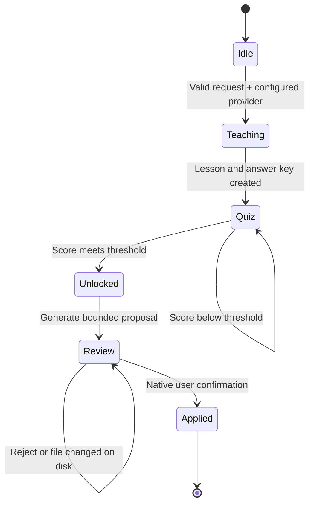

# Wormie AI Copilot Architecture

## Product decision

Wormie is a learning-gated change engine, not an autonomous shell with a quiz layered on top.

The invariant is enforced in Electron's main process:

1. Analyze a bounded workspace context.
2. Teach prerequisites without producing implementation code.
3. Grade a server-owned quiz.
4. Generate a proposal only after the configured passing score is met.
5. Apply only after a native confirmation and a stale-file check.

Renderer state is never trusted to unlock generation or apply a proposal.

## Major-change understanding gates

Generated proposals now pass through a second, change-specific gate after generation and before apply. Staged Git changes use the same domain before the desktop app can create a commit. A deterministic classifier scores file/line scope together with authentication, database, dependency, shared API, state, Electron IPC, filesystem, network, environment, concurrency, security-boundary, test-removal, and generated-confidence signals. Default policy gates major and critical changes; critical checks require at least 90%.

Every pass is bound to a SHA-256 fingerprint of normalized paths, statuses, patches, before/after proposal content, and staged Git contents. Apply and commit handlers recompute classification and fingerprints in the main process immediately before mutation. A modified proposal or staged diff cannot reuse a stale pass.

`understanding-state` is a versioned `electron-store` document because that is the repository's established persistence abstraction. It stores active public quiz state, main-process-only answer keys and rubrics, autosaved answers, attempts, pass/bypass state, history, mastery, and privacy-safe audit metadata. Migration normalizes old or malformed settings. Source, diff, answer, and filename contents are never included in audit events.

Quiz generation uses separate structured model operations for concept extraction, grounded quiz generation, and semantic grading. Context excludes sensitive paths, binaries, dependency lockfile noise, and large hunks, then redacts likely credentials. The renderer receives no correct answers or rubrics. Exact formats are graded locally; written reasoning is conservatively graded through the configured provider and fails closed when verification is unavailable.

## Runtime states

Sessions and proposals expire after 30 minutes. Proposals are one-shot and bound to SHA-256 hashes of every updated file.
Quiz attempts are capped at three per session to prevent renderer-side brute forcing.

## Trust boundaries

### Renderer

- Displays lessons, questions, and proposals.
- Never receives an API key or quiz answer key.
- Cannot write an AI proposal directly.
- Sends only typed IPC messages exposed by the preload bridge.

### Electron main process

- Owns provider credentials, sessions, grading, proposal validation, and writes.
- Encrypts persisted API keys with Electron `safeStorage`; if unavailable, keeps the key in memory for the current app session only.
- Allows HTTPS provider URLs and loopback-only HTTP for local models.
- Reads only workspace files that pass path, size, binary, and secret-name filters.
- Redacts common inline token, password, and private-key patterns before sending context.
- Rejects absolute paths, traversal, `.git`, `node_modules`, and secret-like output paths.
- Requires a native dialog before writes and attempts rollback if a multi-file write fails.

### Model/provider

- Receives the request, a capped manifest, and a capped set of saved text files.
- Has no Wormie tools, terminal, browser, deletion, or direct write capability.
- Treats repository text as untrusted data to reduce prompt-injection risk.
- Returns structured teaching or proposal data that is validated before use.

## Provider strategy

### Available now: OpenAI-compatible BYOK

The first adapter supports providers exposing an OpenAI-compatible `/chat/completions` API. The user supplies a base URL, model ID, and provider-specific API key. This covers OpenAI and many gateways or local runtimes, but it does not mean that one key works across unrelated providers.

Native Anthropic, Gemini, Bedrock, Azure, and local-provider adapters should be added behind the same gateway interface. Each adapter must declare its structured-output, tool-calling, streaming, and cancellation capabilities rather than pretending all providers behave identically.

### Available now: Codex account

Wormie bundles the official Codex runtime and communicates with its app-server JSON-RPC protocol. The user signs in through the official HTTPS ChatGPT browser flow, while account status, turn lifecycle, cancellation, and structured output remain inside Electron's main process. Wormie does not read, copy, or parse `~/.codex/auth.json`.

The adapter creates a Wormie-owned `CODEX_HOME` and an empty runtime directory. Its config fixes approvals to `never`, the sandbox to read-only, and disables shell access, shell snapshots, web search, MCP/remote plugins, apps, hooks, memories, goals, and multi-agent behavior. Each model call uses an ephemeral thread, read-only turn policy, no network access, and rejects any server-initiated request. Repository context is supplied only through Wormie's separately filtered prompt pipeline.

The packaged native executable is resolved per supported OS and architecture and unpacked from the Electron archive for execution. Startup and account handshakes are covered by an integration test against the real bundled app-server, not a mock.

API-key use and ChatGPT subscription use are distinct billing/auth paths. The settings UI identifies the active path: OpenAI-compatible connections consume the supplied provider key, while Codex account connections consume the signed-in ChatGPT plan's Codex allowance. A ChatGPT login is never presented as or converted into an API key.

Wormie intentionally does not expose a Codex logout control yet. Codex credentials live in the operating system credential store and may be shared with other official Codex surfaces; silently removing them from an IDE could sign the user out elsewhere.

## Proposal policy

Current proposal limits:

- 12 files maximum.
- 500 KB maximum generated content per file.
- Create and update only; no deletion, rename, dependency installation, or commands.
- New files may be created only inside an existing workspace folder.
- Open unsaved editor documents block a new request so model context cannot silently lag behind the editor.

Future permissions should be explicit capabilities with three values: deny, ask every time, or allow for this workspace. Destructive actions must never have an always-allow option.

## Reliability requirements

- Stream status and structured partial output over IPC without exposing provider internals.
- Move consolidated learning history to SQLite when the repository introduces its planned database layer; keep current gate state main-process-owned in the versioned local store.
- Retry rate limits and transient 5xx failures with bounded exponential backoff and jitter; never retry auth, validation, or safety failures.
- Add per-provider health checks, model capability detection, token estimates, cost ceilings, and request cancellation.
- Redact provider errors before logging; never log prompts by default because source code may be sensitive.
- Add crash recovery for proposals without restoring an unlocked gate indefinitely.
- Add deterministic contract tests with fake providers and adversarial fixtures for traversal, symlinks, prompt injection, stale files, malformed JSON, duplicate paths, huge output, cancellation, and partial-write rollback.

## Learning quality roadmap

1. Expand the current change concept extraction into a persistent prerequisite graph.
2. Calibrate understanding confidence beyond the current weighted difficulty, retry, and free-response evidence.
3. Add spaced review scheduling to the persisted concept mastery model; never equate one passed quiz with permanent mastery.
4. Explain each accepted function, security implication, and verification result after implementation.
5. Let advanced users test out of known concepts while preserving main-process proof of mastery.

## Definition of world-class

The feature is ready for broad release only when users can understand exactly what context was sent, what the model may do, what it will cost, why generation is locked, what changed, and how to undo it. Provider flexibility must not weaken those guarantees.
