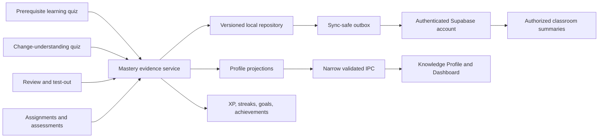

# Mastery and Knowledge Profile Design

## Purpose

Learn Before You Code will maintain one device-wide learner profile that survives restarts and synchronizes to the authenticated Wormie account. Workspaces, AI learning sessions, change-understanding checks, reviews, challenges, assignments, and teacher assessments contribute evidence to that profile without weakening either generation gate.

The governing rule remains: **Understand first. Generate second.** Mastery personalizes instruction and explains progress; it never lets renderer state unlock generation or apply a change.

## Chosen approach

The main process owns a cohesive mastery domain behind a repository interface. The first adapter uses the existing versioned `electron-store` because the repository has no SQLite layer. A future SQLite adapter can replace it without changing services, IPC, prompts, or renderer code. Supabase receives a deliberately limited sync projection, not the private local record.

Two alternatives were rejected:

1. Workspace-scoped profiles would make the same learner appear unassessed in every new project and undermine prerequisite personalization.
2. Adding `better-sqlite3` now would introduce a native dependency, packaging work, and migration risk before the application has an established database runtime. The architecture guidance explicitly permits a repository abstraction until SQLite exists.

## Domain architecture

The mastery domain is split into focused modules:

- `catalog.ts`: the versioned canonical taxonomy and deterministic alias normalization.
- `graph.ts`: graph validation, traversal, depth, ancestors, dependents, and blocking prerequisites.
- `model.ts`: pure evidence application, decay, confidence, status, and explanations.
- `reviews.ts`: deterministic spaced-review scheduling with injected clocks.
- `misconceptions.ts`: recurrence, remediation, and resolution state transitions.
- `gamification.ts`: idempotent XP, levels, streaks, badges, achievements, and milestones.
- `goals.ts`: bounded goal creation, progress, and completion.
- `personalization.ts`: explicit preferences separated from resettable inferred signals.
- `repository.ts` and `migrations.ts`: validated persistence, legacy conversion, and schema migrations.
- `service.ts`: transactional orchestration and sanitized read models.
- `sync.ts`: privacy-safe outbox, conflict resolution, retry, and account merge.
- `ipc.ts`: trusted-sender checks, Zod validation, pagination limits, and narrow handlers.

## Canonical taxonomy and knowledge graph

The bundled catalog covers every domain in `PROJECT.md` with meaningful sub-concepts rather than one broad score per domain. Canonical IDs use stable dot-delimited identifiers such as `javascript.closures`, `typescript.generics`, `electron.security.context-isolation`, `ipc.validation`, and `authentication.sessions`.

Each catalog entry contains ID, name, description, domain, depth, prerequisites, required prerequisite mastery, aliases, state, and catalog version. Aliases are normalized by trimming, lowercasing, collapsing punctuation, and resolving a prevalidated lookup table. Exact canonical IDs win over aliases. Duplicate IDs, duplicate ambiguous aliases, missing prerequisites, and cycles reject the catalog at startup and in tests.

Unknown AI concepts are registered locally as deterministic custom concepts. Their ID derives from a normalized label plus a stable hash, so repeated equivalent terminology maps to the same record. Custom concepts have no implicit prerequisites and never mutate the bundled catalog. Mapping failures keep the quiz usable but record no mastery until a safe canonical/custom resolution exists.

Graph queries return sorted deterministic results with visited-set cycle protection. Learning-plan construction finds weak transitive prerequisites using both mastery and confidence. Unassessed users receive diagnostic questions and can test out; missing history alone never permanently blocks an advanced user.

## Evidence and mastery model

Every gradable response becomes immutable, question-level `MasteryEvidence` with a globally unique evidence ID and a stable deduplication key. It records only privacy-safe metadata: canonical concept ID, source, session and assessment identifiers, attempt, question format, difficulty, normalized score from 0 to 1, timestamp, independence group, critical-misconception flag, and optional assignment/classroom linkage. It does not store prompts, answer keys, raw answers, source code, filenames, or provider context.

Unseen concepts start as `unassessed`, score 0, and confidence 0. The displayed profile always pairs score with confidence and excludes unassessed concepts from misleading averages.

The deterministic pure model uses weighted evidence:

- Difficulty weights: easy 0.8, medium 1.0, hard 1.25.
- Format reliability accounts for guessing risk: multiple choice 0.7, true/false 0.55, multiple select 0.9, prediction/debug/code ordering 1.1, short answer 1.2, and teacher-reviewed applied work 1.3.
- Partial semantic grades use their bounded 0–1 score rather than a forced binary result.
- Repeated attempts within one assessment share an independence group and receive diminishing influence; only the best bounded contribution from that group affects the aggregate.
- Evidence IDs and deduplication keys make replay a no-op.
- Recent evidence has full weight; older evidence decays toward uncertainty rather than toward an arbitrary 50. Decay lowers effective confidence and can set `review_due` without erasing historical score.
- Critical misconceptions cap proficiency until later independent evidence resolves them.
- Confidence grows from effective evidence quantity, format diversity, source diversity, session diversity, and recency. It is capped when evidence is repetitive.

The score is a weighted Bayesian-style success ratio with conservative priors used only internally for calibration. A concept is not displayed as assessed until real evidence exists. Status is derived deterministically from score, confidence, due state, and misconceptions: `unassessed`, `learning`, `weak`, `developing`, `proficient`, `strong`, or `review_due`.

Each profile view includes an explanation containing the principal positive evidence, negative evidence, freshness, diversity, confidence limitation, prerequisite blockers, and review state. Score history stores bounded snapshots after material state changes.

## Unified learning paths and gates

The prerequisite gate in `src/main/agent/index.ts` continues to control whether code can be generated. Its structured lesson and quiz schemas gain canonical concept IDs, difficulty, and question format. Submission records question-level evidence only after main-process grading. Repeating the same session attempt cannot inflate mastery.

The change-understanding gate continues to control applying significant AI proposals and committing significant staged changes. It still binds passes to change fingerprints and keeps private grading keys in the main process. Its arbitrary generated IDs are resolved through the catalog before quiz creation. Existing quiz and history records remain available after migration.

Gate decisions remain local to their sessions and configured thresholds. Mastery may tune teaching, select weak prerequisites, and inform question difficulty, but it never fabricates a gate pass. A diagnostic test-out is itself a fresh main-process assessment. Developer bypass records no mastery, XP, badges, or streak credit.

## Misconceptions and review scheduling

Incorrect evidence can create a sanitized misconception record containing a short model-generated or deterministic summary, corrective explanation, source, difficulty, format, timestamps, recurrence count, remediation status, and resolving evidence ID. Renderer IPC never exposes correct answers, rubrics, raw answers, prompts, code, or filenames.

The review scheduler is a pure function with an injected clock. A first successful assessment schedules a short interval based on confidence. Successful reviews increase stability and interval; partial results grow it slowly; failures reset the interval, increment lapses, create remediation, and raise forgotten-topic risk. Overdue duration and risk are calculated at read time. Review sessions always request fresh question generation and use private main-process grading.

## Personalization

Explicit preferences store teaching style, lesson verbosity, example style, quiz difficulty, review tolerance, goals, and whether inferred personalization is enabled. Inferred signals store format performance, recurring misconceptions, pace, strong/weak concepts, and review behavior separately. Users can disable or reset inferred signals without losing mastery evidence.

Prompt builders receive a bounded sanitized personalization projection. They never receive source paths, raw answers, or unrelated history.

## Gamification and goals

Reward rules consume accepted evidence events and emit immutable award records keyed by rule ID and source evidence ID. This makes XP and achievements idempotent. Rewards scale with difficulty, format reliability, first-pass success, independent sessions, review completion, and misconception resolution. Repeated easy attempts, bypasses, duplicate evidence, and ungraded activity award nothing.

Levels derive from total XP through a documented monotonic curve. Daily and weekly streaks use the user’s local calendar date at event time and count only qualifying learning activity. Achievement and badge records include rule version, reason, source, and earned timestamp. Goals are bounded, typed, and progress only from accepted evidence or review events.

## Local persistence and migration

The mastery state is a new schema-versioned document owned by a `MasteryRepository`. All restored values pass strict Zod validation and field-level normalization. Corrupt records are dropped individually when safe; unrecoverable state is backed up in memory for diagnostics and replaced with a valid empty state rather than trusted shallowly.

Migration imports every legacy `KnowledgeMastery` record from `understanding-state`. Names and IDs resolve through the canonical catalog. A legacy record becomes a low-confidence historical snapshot with bounded counts and its existing evidence quiz IDs preserved as deduplication references. It never starts at 50 merely because the old implementation did. Existing understanding gates, private keys, drafts, history, and settings remain in their current store and continue working.

Device-wide ownership is explicit. Workspace and assignment identifiers are optional evidence provenance, not profile partitions.

## IPC and renderer state

The preload exposes narrow typed methods for overview, domains, concept details, evidence pages, misconceptions, reviews, personalization, goals, gamification, sync status, and authorized teacher summaries. Every handler checks the trusted renderer sender, parses inputs with Zod, caps string lengths, restricts enum values, and bounds pagination to 1–100 items.

The renderer receives sanitized view models only. React Query owns profile queries and invalidates a shared mastery query key after quiz, remediation, review, goal, assignment, and sync mutations. This replaces the current one-time `QuizHistory` fetch and prevents stale mastery displays.

## Knowledge Profile and Dashboard UI

The Knowledge activity becomes a responsive profile surface consistent with the existing dark IDE. It provides an overall mastery-with-confidence summary, domain distribution, strong/weak/unassessed/review-due sections, search, filters, sorting, a semantic mastery heatmap, progression charts, improvements/regressions, misconceptions, review queue, goals, and gamification.

Concept selection opens a detail view with description, score explanation, prerequisites/dependents, blockers, evidence timeline, score progression, misconceptions, review schedule, recommendation, and working review/test-out actions. Empty profiles show honest onboarding and no fabricated estimates. Loading uses accessible status text; errors use `role="alert"`; controls are keyboard reachable; charts include text equivalents; color is never the only status indicator; reduced-motion preferences disable nonessential animation.

The dashboard projection computes quiz accuracy, mastery activity by period, domain distribution, recent changes, reviews, and an estimated growth curve from actual dated evidence. Estimates are labeled and omitted when evidence is insufficient.

## Sync and classroom visibility

Supabase migrations add user-owned mastery summaries, sync-safe evidence metadata, review schedules, goals, achievements, and an idempotent mutation ledger. Rows contain schema version, source device ID, logical version, updated timestamp, and deterministic event IDs. Local mutations enter an outbox and retry with bounded exponential backoff while the app is authenticated and online. Signed-out and offline use remains fully functional.

Conflict resolution is field-aware: immutable evidence and awards union by stable ID; profile aggregates are recomputed from merged evidence; goal edits use logical version plus updated time; review state selects the latest accepted review outcome. Server responses are validated before local merge.

Teacher-facing database views/RPCs expose only students in classrooms where the caller is an authorized teacher. They return domain summaries, weak/review-due concepts, trends, assignment-linked evidence, and cohort aggregates with explicit insufficient-evidence counts. Students can read only their own private mastery rows and cannot enumerate classmates. Teachers never receive raw answers, answer keys, prompts, source code, secrets, filenames, workspace paths, or private non-classroom evidence. RLS helper functions use fixed search paths and minimal grants.

## Testing and verification

Development follows red-green-refactor. Pure domain tests cover catalog resolution, custom concepts, graph integrity and traversal, prerequisite blocking, unassessed behavior, weighting, partial grades, guessing risk, repeated attempts, deduplication, confidence, decay, reviews, misconceptions, migrations, corruption handling, XP, achievements, streaks, goals, sync merging, and classroom authorization projections.

Integration tests cover both quiz paths, bypass behavior, assignment evidence, IPC validation/trust, query invalidation, and teacher summaries. Renderer behavior is tested through focused pure view/query models consistent with the repository’s current Vitest setup; component DOM tests are added only if the existing test environment is extended deliberately.

The current baseline has 17 unrelated Windows assignment-storage failures caused by the existing file-identity comparison. The implementation includes a narrow test-first normalization fix because final acceptance requires the entire suite to pass. Type checking currently passes, and the production build passes outside the restricted filesystem sandbox.

Completion requires exact successful runs of:

- `npm test`
- `npm run typecheck`
- `npm run build`

No slice is complete with placeholders, fake data, unsafe IPC, duplicate rewards, weakened gates, or fabricated dashboard metrics.
